```{r, include = FALSE}
knitr::opts_chunk$set(
  collapse = TRUE,
  comment = "#>",
  fig.width = 6,
  fig.height = 4
)
```

## Motivation
<!-- Since its development in 1973, the U.S. Rehabilitation Services Agency (RSA) has the main goal of improving the employment opportunities for citizens with disabilities. As part of this focus, the RSA works with agencies in each state to provide services for students with disabilities to improve employment readiness, expose them to career and higher education opportunities, and increase their earning potential. Each state collects administrative data on participants' outcomes in a specific structure, called a Case Services Report, which is often abbreviated as “RSA-911” data. These RSA-911 datasets contain information on participant demographics, as well as enrolled services combinations and employment and education outcomes. The RSA-911 datasets capture a wealth of critical information; however, the structure of the data is not in a practical format for classical statistical, machine learning, or visualization techniques. Due to this complicated format, much of the potential for analysis and modeling remains untapped. Currently, most of the existing research is devoted to predicting categorical or binary outcome variables, such as employment status at exit from VR service. More notably, many studies focus investigation on a small, overlapping subset of predictor variables.  -->

<!-- With the existing methods for analysis being limited, and many of the features in the data overlooked in past research, there is a push for more efficient and reproducible data preparation, allowing for new explorations. This motivation has only become more charged by the recent development of an additional success metric. Beginning in 2020, the VR researchers and providers in the state of Utah have started collecting pre and post test scores for evaluating skill improvement in each offered service. The hope is that these new score variables will help VR researchers identify the most effective services and advocate for more strategic funding. The VR researchers leading this effort are ready to start examining the worth of these novel pre-post-difference scores, find appropriate methods for analysis, and explore the relationship of these scores with a wide array of demographic variables. Beyond their own analysis, the researchers desire more accessibility to basic analysis for the collaborating VR providers who collect this data.   -->

<!-- This project attempts to address the needs presented by the industry. The first task is to alleviate the burden of data preparation, through the development of an R package geared toward specialized cleaning and analysis for any RSA-911 dataset, as well as the recently collected scores data. The second task is the first ever analysis of relationships between RSA-911 demographics and the novel pre-post-difference scores. The final task is developing a user-friendly \texttt{rshiny} interface that provides a VR professional with limited data analysis experience to easily gain insight into the data they work hard to collect.  -->


Since 1973, the U.S. Rehabilitation Services Administration (RSA) has partnered with state vocational rehabilitation (VR) agencies to help individuals with disabilities achieve meaningful employment and independence. RSA-911 datasets play a crucial role in this effort by capturing detailed participant data, but their complexity can hinder effective analysis.

To simplify this process, we present the \texttt{rsa.helpr} software package to streamline the cleaning and analysis of RSA-911 and Transition Readiness Toolkit (TRT) data, a new measure of program effectiveness. We also deliver a user-friendly dashboard, empowering both VR researchers and counselors with the opportunity to conduct analyses. Using our developed tools, we explore the relationships between RSA-911 and TRT data, providing insights into the expanding TRT initiative. 

Together, our tools enhance efficiency, accessibility, and reproducibility in VR data analysis. Freely available and compatible with any RSA-911 and TRT dataset, our software provides a flexible framework for VR research, fostering consistency and adaptability while supporting future studies.


## Installation and Loading
The package can be installed with the following code:
```{r setup, eval = FALSE}
devtools::install_github("rtaylor456/rsa.helpr")
```

After being installed, we can load the package:
```{r load}
library(rsa.helpr)
```


## Data and Challenges

As each RSA-911 dataset involves data entry by many providers across several VR agencies, the risk of erroneous or missing values is high. Using the codebook as the guide, we searched the variables for values that would need to be adjusted or could be re-coded for more meaning. These incorrect values were then replaced with either a reasonable alternative or missing values. While some missing values represent truly missing data, many of the "NULL" values in RSA-911 datasets actually represent a factor value. These values have been represented with meaningful factor levels for the sake of analysis. Several variables were wholly removed for either containing no meaningful data or unnecessary information. Some additional variables were created during this process to measure variables of interest, for example, enrollment lengths and grade levels. 

Luckily, each quarterly dataset follows the same required variable
naming conventions, allowing us to focus on examining the values within the variables. With
498 variables in the raw data, it follows that there are patterns of similar variable structures. For instance, certain variables that contain "amt" somewhere in the name correspond to monetary amounts, and variables that contain "provide" or "provided" somewhere in the
name correspond to binary values indicating a service, accommodation, enrollment, etc. was
or was not provided. These convenient clusters of variable types were among the simpler to
investigate. For the majority of variables, which did not have an obvious naming similarity
or structure, the values and corresponding keys within the codebook were combed. After
thorough examination of all variables, more groupings were discovered, to help with eventual
cleaning standardization.

As the scores data are newly collected
and therefore contain a fraction of the participants with RSA-911 data, the size is significantly smaller. More importantly, the scores data consist of a concise list of variables--namely the scores for each service, the dates completed, and the itemized reports from each pre and post evaluation. Our focus in cleaning is the restructuring the format of the scores data and variable names to ensure a smooth merge with the quarterly RSA-911 data. Additionally, new variables must be created to aid with analysis, most importantly, median difference score, which is the median per individual across all of their specific service difference scores. This allows for more a more populated and simple response variable to measure.

## Solution: Data Cleaning Package `rsa.helpr`

To achieve the standardization and simplification of data cleaning, our R package, 
`rsa.helpr`, has been developed alongside the process of data preparation. This package provides the opportunity to not only bypass the tedious process of data cleaning, but also to create directly reproducible results.

### Helper Functions
Through the process of data cleaning, small functions were created to handle specific variable
cleaning problems. These functions serve as helper functions for repeated cleaning tasks within larger functions in `rsa.helpr`. However, all of these helper cleaning functions can be used individually, as demonstrated in the proceeding sections.

#### `handle_date`
```{r handle_date}

```

#### `handle_excel_date`
```{r handle_excel_date}

```

#### `handle_year`
```{r handle_year}

```

#### `handle_nines`
```{r handle_nines}

```

#### `handle_blanks`
```{r handle_blanks}

```

#### `handle_code`
```{r handle_code}

```

#### `handle_values`
```{r handle_values}

```


#### `handle_abbrev`
```{r handle_abbrev}

```


#### `handle_splits`
```{r handle_splits}

```

#### `apply_handle_splits`
```{r apply_handle_splits}

```


#### `separate_disability`
```{r separate_disability}

```


### One-Stop Cleaning Functions
As the underlying premise of this package design is reproducibility and simplicity, two main
functions were created to encompass all necessary cleaning steps in one run. Functions
`clean_utah` and `clean_scores` yield fully cleaned datasets, each with a single function call.
These complicated functions do all of the work under the hood for the user, enlisting the
helper functions, additional restructuring steps, and type classification. These functions
utilize regular expressions in order to make variable identification robust against naming
differences. They also include checks to handle conflicts in expected and and observed variable
structures. `clean_utah` and `clean_scores` can be run simply, by inputting only the dataset
and no other arguments, using default settings, as shown below:

#### `clean_utah`
```{r clean_utah}

```


###### `aggregate`
```{r aggregate}

```


###### `unidentified_to_0`
```{r unidentified_to_0}

```


###### `remove_desc`
```{r remove_desc}

```

###### `remove_strictly_na`
```{r remove_strictly_na}

```


###### `clean_specials`
```{r clean_specials}

```


#### `clean_scores`
```{r clean_scores}

```


###### `state_filter`
```{r state_filter}

```


###### `clean_ID`
```{r clean_ID}

```


###### `aggregate`
```{r aggregate2}

```


###### `ID_col`
```{r ID_col}

```


### Merge and Metadata Functions
In order to run analysis to link the effects of the RSA-911 demographic data to the scores
results, we needed to merge and condense our data. Again, functions were created to
handle the mechanics of these processes while maintaining simplistic calls for the user.
`merge_scores` takes cleaned quarterly and scores data and conducts a merge, resulting in
only data corresponding to matched participants. `create_metadata` in turn takes a cleaned,
merged dataset and condenses to metadata, with one row per unique participant. This
function uses the same methods as described in the Data Cleaning section to summarize
(medians, most common occurrences, most recent values).

#### `merge_scores`
```{r merge_scores}

```

#### `create_metadata`
```{r create_metadata}

```


### Full Data Cleaning Process Example
Below is an example of the process of producing fully cleaned, condensed 
metadata using `rsa.helpr` functions:

```{r example, eval=FALSE}
# Cleaning an RSA-911 datset using defaults
data_cleaned <- clean_utah(data)

# Cleaning a scores dataset using defaults and extracting only Utah data
scores_cleaned <- clean_scores(scores, state_filter = "Utah")

# Merge the datasets, keep only relevant participants, using defaults
merged_data <- merge_scores(data_cleaned, scores_cleaned)

# Generate the condensed metadata
metadata <- create_metadata(merged_data)

```

These four functions provide any researcher with a completely reproducible process for
preparing data, all with incredible ease.


## An Interactive `rshiny` Data Dashboard
While our `rsa.helpr` package alleviates the burden of data cleaning within R, aiding VR
researchers in their study, the level of accessibility needs to be extended. Beyond VR
researchers, the hope is to allow visibility of summaries and results to those professionals who
are actually working with participants and recording these data. Requiring a familiarity with
R creates a degree of separation between the VR professionals and their data interpretation.
To mitigate this, we have developed an interactive data dashboard, titled "RSA-911 Data Exploration", that will be made accessible
online. This `rshiny` dashboard runs on the `rsa.helpr` package, maintaining a consistent
thread between any analysis run in R or observed in the dashboard.

### Data Upload and Cleaning
The user begins by uploading their desired quarterly RSA-911 and/or scores
dataset(s). The following example shows one RSA-911 large dataset uploaded, but the
user may upload several files at once. Once the datasets are fully uploaded, the dashboard
automatically begins applying the cleaning functions to the data. The adjustable function
arguments are provided as checkbox options for the user. Any time the user adjusts the
selections, the cleaning function will re-run. The status is shown in the progress bars. Once
the datasets are uploaded and fully cleaned, they are stored in the session and displayed with
a dimension summary for inspection.


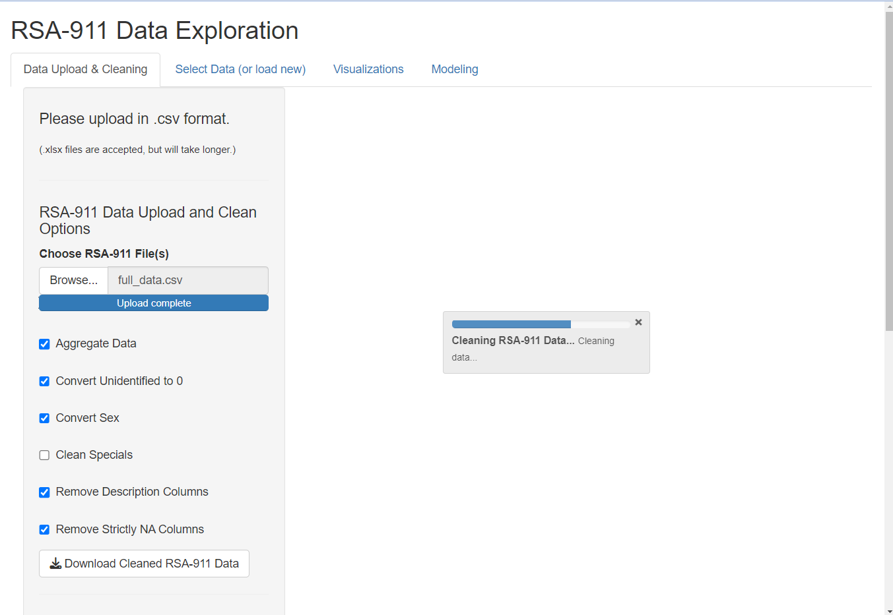{width=500px}
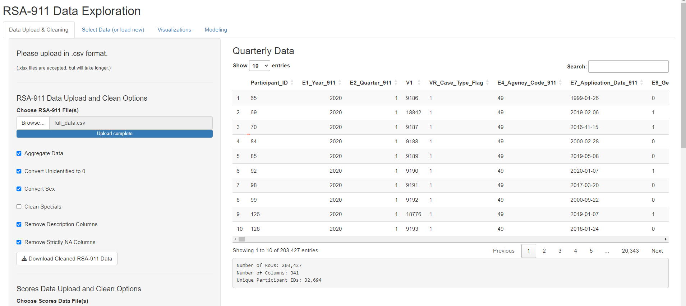{width=500px}


If the user uploads both quarterly and scores data, the dashboard automatically
creates a merged data set, displayed in the main page. As condensing the data is a slower process, the metadata will not be generated automatically. The user may click the "Generate
Metadata" button to initiate this. Again, a progress bar will indicate status and the final data
will be displayed. (Note: the user may choose to create metadata using only the quarterly
data, but this is not the default.)

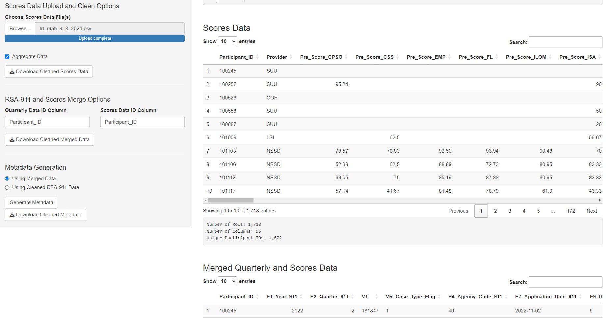{width=500px}
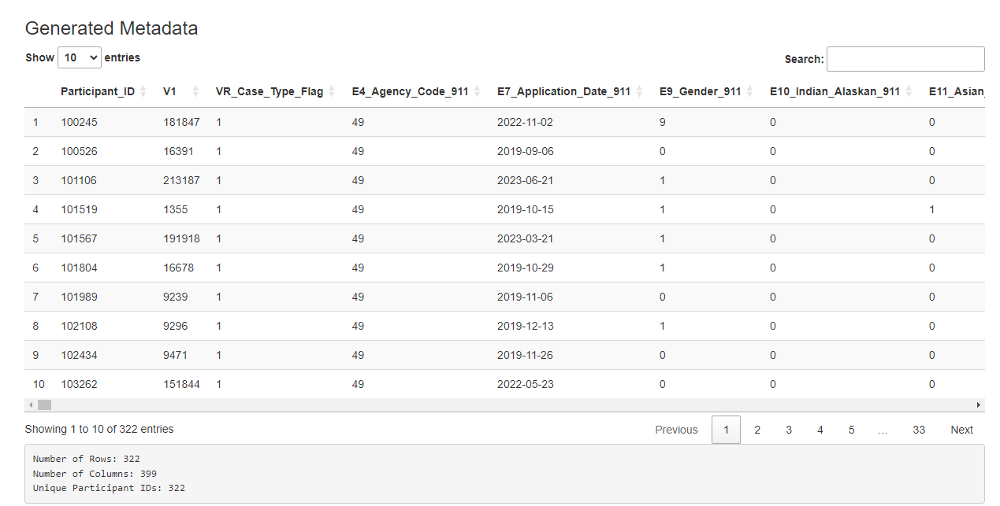{width=500px}

### Selecting a Dataset
Now, with the datasets stored in the session, we choose which one we would like
to visualize and model. The user has the option to upload a new dataset, and select which
type. This is an option provided for a user who has already cleaned the data using the app
and is returning in a new session.

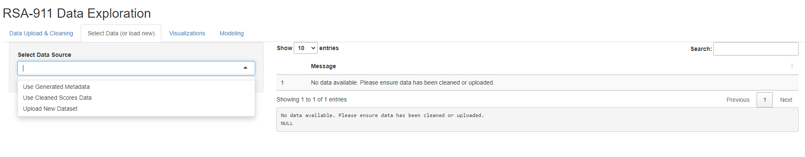{width=500px}

#### Selecting Metadata
Different visualization tabs pop up depending on the dataset selected. When the
user selects "Use Generated Metadata", they have four tabs with many visuals on each to
examine. Some provide general visual summaries of high interest demographics, some provide
visuals relevant to modeling options. This figure provides an example of the output.

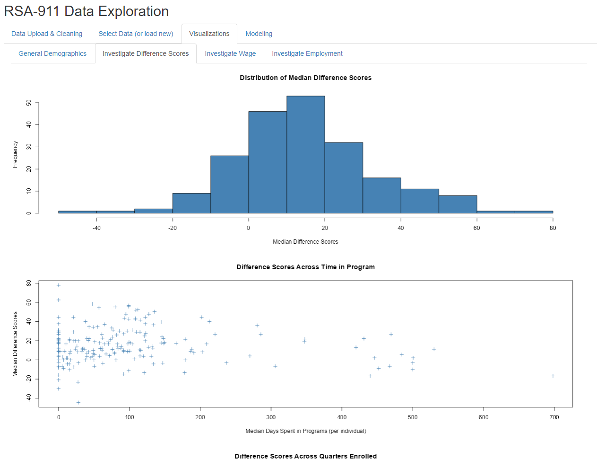{width=500px}

Different modeling options pop up depending on the dataset selected.
When the user selects "Use Generated Metadata", they have the option of fitting OLS
models for predicting Median Difference Score or Ending Wage, or fitting a logistic regression
model for predicting Employment Outcome (1: competitively employed, 0: not competitively
employed). Then, the user can select different combinations of predictors, with the model
being recalculated for each change. Note that this subset of predictors was selected for
simplicity and based on the advice of our collaborator, Dr. Phillips. Once fitted, the model
output will then be shown, as well as its corresponding residual plots.

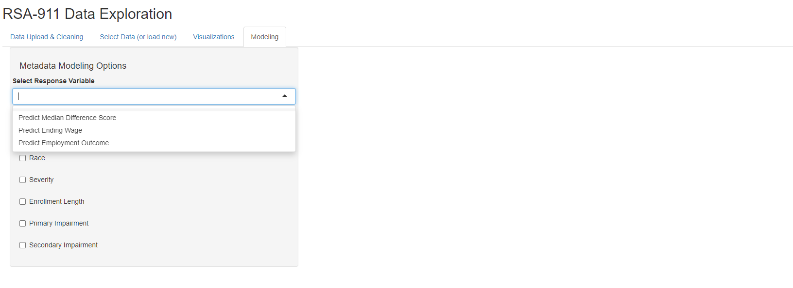{width=500px}

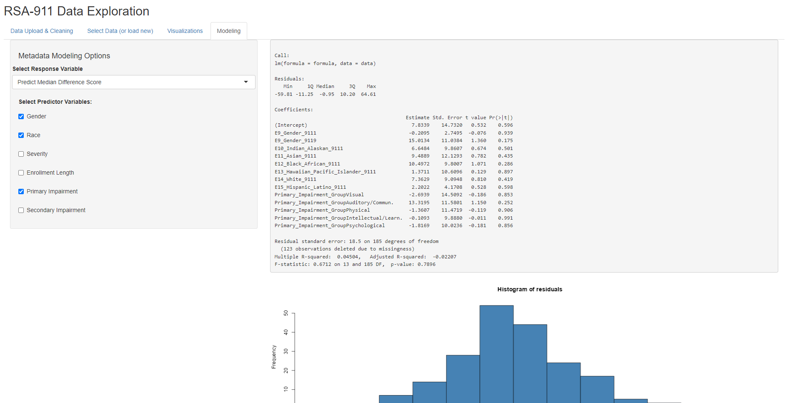{width=500px}

#### Selecting Scores Data
When the user selects "Use Cleaned Scores Data", they have three tabs
with several visuals on each to examine. Some provide general visual summaries of score
distributions, some provide visuals relevant to modeling options. This figure provides an
example of the output.

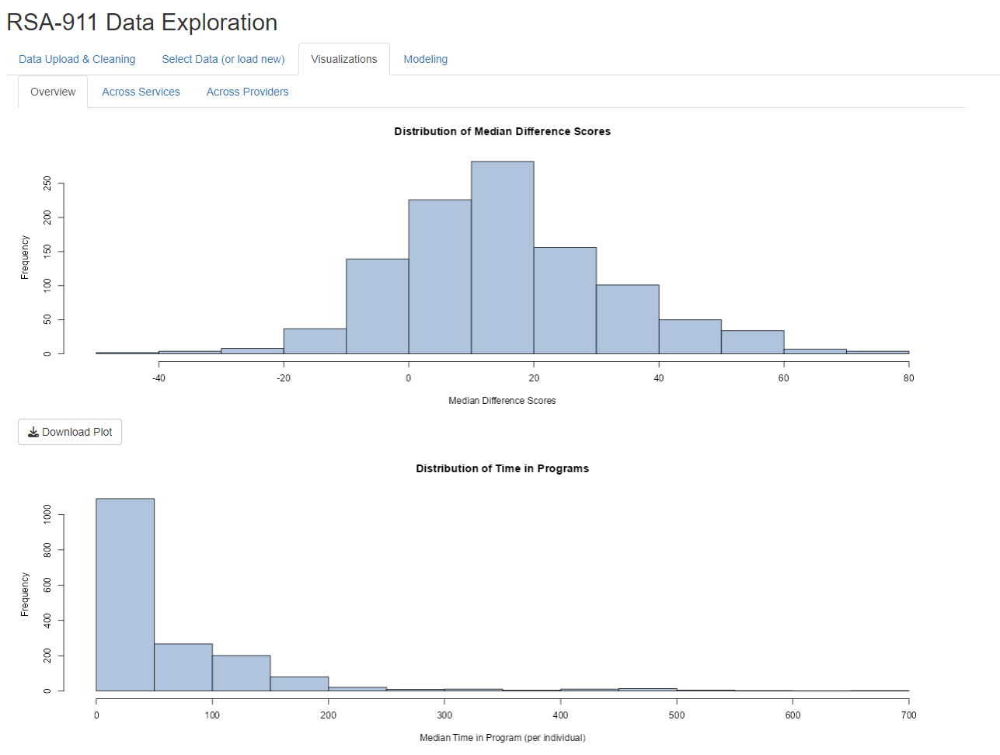{width=500px}

When the user selects "Use Cleaned Scores Data", they have the option of
two different ANOVA models, either for comparing median difference scores across services or
across providers. Once run, the ANOVA output will then be shown, as well as any significant
pairwise comparisons and residual plots.

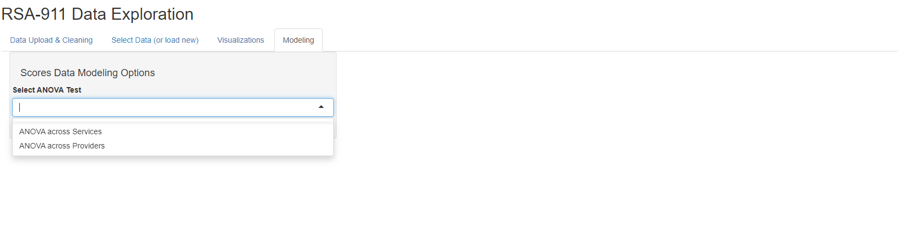{width=500px}
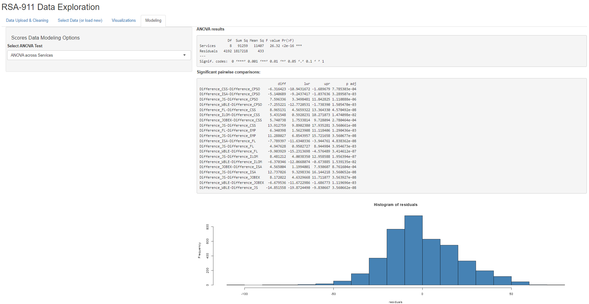{width=500px}

## Conclusion
The `rsa.helpr` package provides VR researchers with a tool to prepare data more efficiently
and consistently, allowing their focus to be on exploration and analysis. Additionally,
through its support in the interactive "RSA-911 Data Exploration" dashboard, `rsa.helpr` provides VR professionals the opportunity to monitor and explore key trends as they do the ground work of data collection. 
As this project is part of ongoing thesis research, there is more refinement left before it is
complete. The majority of the focus will be on the remaining edits and additions to the
package and the dashboard application, as these are the significant contributions to the
field. Once our dashboard is finalized, we
will release it in an online form, so that it can be accessed without requiring R installation.
